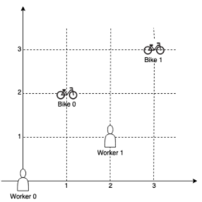
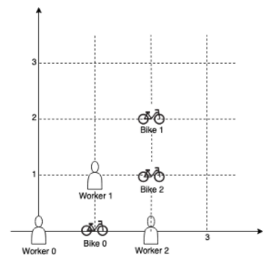

On a campus represented as a 2D grid, there are N workers and M bikes, with N <= M. Each worker and bike is a 2D coordinate on this grid.

We assign one unique bike to each worker so that the sum of the Manhattan distances between each worker and their assignment is minimized.

The Manhattan distance between two points p1 and p2 is | p1.x - p2.x | + | p1.y - p2.y |.

Return the minimum possible sum of Manhhatan distances between each worker and their assigned bike.

**Example 1:**



**Input:** workers = [[0,0], [2,1]], bikes = [[1,2],[3,3]]
**Output:** 6

**Explanation:**

We assign bike 0 to worker 0, bike 1 to worker 1. The Manhattan distance of both assignments is 3, so the output is 6.

**Example 2:**



**Input:** workers = [[0,0], [1,1], [2,0]], bikes = [[1,0],[2,2],[2,1]]
**Output:** 4

**Explanation:**

We first assign bike 0 to worker 0, then assign bike 1 to worker 1 or worker 2, bike 2 to worker 2 or worker 1. Both assignments lead to sum of the Manhattan distances as 4.

**Note:**

1. 0 <= workers[i][0], workers[i][1], bikes[i][0], bikes[i][1] < 1000
2. All worker and bike locations are distinct.
3. 1 <= workers.length <= bikes.length <= 10

```js
// Backtracking

const assignBikesDist = (workers, bikes) => {
  const usedBikes = {};
  let res = Infinity;

  const occupy = (i, dist) => {
    if (i === workers.length) {
      res = Math.min(res, dist);
      return;
    }
    for (let j = 0; j < bikes.length; j++) {
      if (!usedBikes[j]) {
        usedBikes[j] = true;
        const d = getDist(bikes[j], workers[i]);
        occupy(i + 1, dist + d);
        usedBikes[j] = false; // reset
      }
    }
  };

  occupy(0, 0);
  return res;
};

const getDist = ([x1, y1], [x2, y2]) => Math.abs(x1 - x2) + Math.abs(y1 - y2);
```
