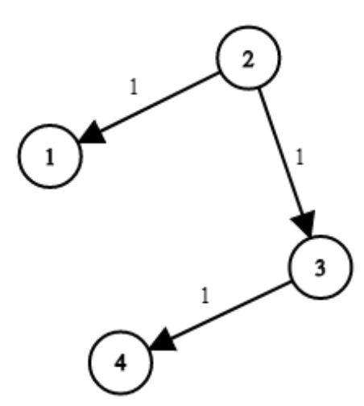

There are N network nodes, labeled 1 to N.

Given times, a list of travel times as directed edges times[i] = (u, v, w), where u is the source node, v is the target node, and w is the time it takes for a signal to travel from source to target.

Now, we send a signal from a certain node K. How long will it take for all nodes to receive the signal? If it is impossible, return -1.

**Example 1:**



**Input:** times = [[2,1,1],[2,3,1],[3,4,1]], N = 4, K = 2

**Output:** 2

**Explanation:**

2->1 time = 1, 2->3 time = 1, 2->3->4 time = 2

**Note:**

1. N will be in the range [1,100]
2. K will be in the range [1,N]
3. The length of times will be in the range [1,6000]
4. All edges times[i] = (u, v, w) will have 1 <= u, v <= N and 0 <= w <= 100

```js
const networkDelayTime = (times, N, K) => {
  const processList = [];
  const visitedList = [];

  const graph = createGraph(N, times);
  const unvisited = Object.values(graph);

  let minTime = 0;

  graph[K].time = 0;
  graph[K].visited = true;

  processList.push(graph[K]);

  while (processList.length) {
    const smallest = popSmallestTime(processList);

    minTime = smallest.time;

    // visit and update smallest time for each neighbor
    smallest.next.forEach(([next, time]) => {
      if (smallest.time + time < next.time) {
        next.time = smallest.time + time;
      }
      if (!next.visited) {
        processList.push(next);
        next.visited = true;
      }
    });

    visitedList.push(smallest);
  }

  return visitedList.length !== N ? -1 : minTime;
};

// create adjacency list
const createGraph = (numNodes, edges) => {
  const graph = {};

  for (let i = 1; i <= numNodes; i++) {
    graph[i] = new Node(i);
  }

  edges.forEach(([u, v, t]) => {
    graph[u].next.push([graph[v], t]);
  });

  return graph;
};

// pop smallest node based on time
const popSmallestTime = list => {
  let min = Infinity;

  const minIndex = list.reduce((acc, e, i) => {
    if (e.time < min) {
      min = e.time;
      return i;
    }

    return acc;
  }, 0);

  return list.splice(minIndex, 1)[0];
};

class Node {
  constructor(name) {
    this.name = name;
    this.next = [];
    this.visited = false;
    this.time = Infinity;
  }
}
```
