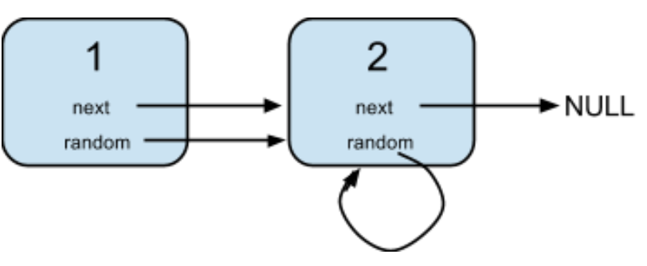

A linked list is given such that each node contains an additional random pointer which could point to any node in the list or null.

Return a deep copy of the list. You must return the copy of the given head as a reference to the cloned list.

Example 1:


Time Complexity: O(n)
Space Complexity: O(n)

```js
/*

Definition for a Node.
function Node(val,next,random) {
  this.val = val;
  this.next = next;
  this.random = random;
}

Input:
{"$id":"1","next":{"$id":"2","next":null,"random":{"$ref":"2"},"val":2},"random":{"$ref":"2"},"val":1}

Explanation:
Node 1's value is 1, both of its next and random pointer points to Node 2.
Node 2's value is 2, its next pointer points to null and its random pointer points to itself.
*/

const copyRandomList = head => {
  // create dummy head
  const copy = new Node(null);
  // grab a reference to copy
  let curCopy = copy;
  // grab a reference to head
  let cur = head;
  // create a clone hash map
  const cloneMap = new Map();

  while (cur) {
    // create our temp cur node
    let temp = new Node(cur.val);
    // set current copy node's next to temp
    curCopy.next = temp;
    // move curCopy to next value
    curCopy = temp;
    // set our hash map with cur node reference, and it's copied node
    cloneMap.set(cur, temp);
    // traverse to our next node
    cur = cur.next;
  }
  // reset cur back to head
  cur = head;
  // traverse one more time to find random pointers and connections with hash map
  while (cur) {
    // if we have a random pointer
    let origRandom = cur.random;
    if (origRandom) {
      // get the hashMap's clone node and set the random pointer to the clone node
      cloneMap.get(cur).random = cloneMap.get(origRandom);
    }
    // travere to our next node
    cur = cur.next;
  }
  // return our deep copy linked list
  return copy.next;
};
```

Credits to: [leetcode.com](https://leetcode.com/problems/copy-list-with-random-pointer/)
