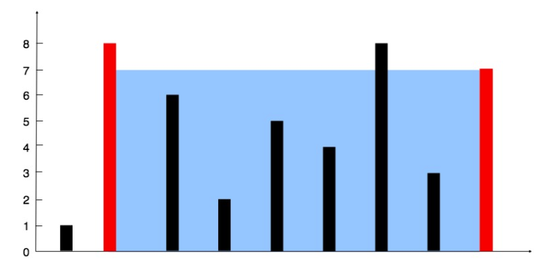

Given n non-negative integers a1, a2, ..., an , where each represents a point at coordinate (i, ai). n vertical lines are drawn such that the two endpoints of line i is at (i, ai) and (i, 0). Find two lines, which together with x-axis forms a container, such that the container contains the most water.

Note: You may not slant the container and n is at least 2.



The above vertical lines are represented by array [1,8,6,2,5,4,8,3,7]. In this case, the max area of water (blue section) the container can contain is 49.

```js
const containerMostWater = heights => {
  let maxArea = -Infinity;
  let beg = 0;
  let end = heights.length - 1;

  while (end > beg) {
    let minHeight = Math.min(heights[beg], heights[end]);
    maxArea = Math.max(maxArea, minHeight * (end - beg));

    heights[beg] < heights[end] ? beg++ : end--;
  }

  return maxArea;
};
```

Credits to: [leetcode.com](https://leetcode.com/problems/container-with-most-water/)
