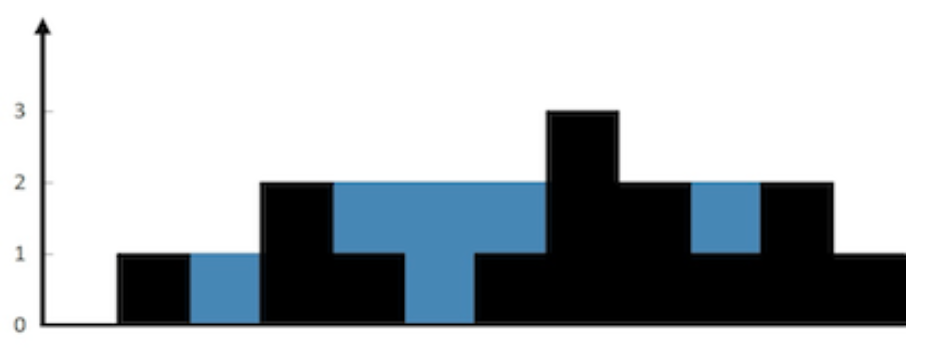

Given n non-negative integers representing an elevation map where the width of each bar is 1, compute how much water it is able to trap after raining.



**Example:**

**Input:** [0,1,0,2,1,0,1,3,2,1,2,1]
**Output:** 6

```js
// Time Complexity: O(n)

const trapWater = blocks => {
  const rightMaxes = [];
  let rightMax = 0;

  for (let i = blocks.length - 1; i >= 0; i--) {
    rightMax = Math.max(rightMax, blocks[i]);
    rightMaxes[i] = rightMax; // set tallest right boundary at each index
  }

  let leftMax = 0;
  let collectedWater = 0;
  for (let i = 0; i < blocks.length; i++) {
    leftMax = Math.max(leftMax, blocks[i]);
    // grab current tallest right boundary at left index
    const rightHighest = rightMaxes[i];
    // get minimum height of both boundaries and subtract from current shortest boundary
    collectedWater += Math.min(leftMax, rightHighest) - blocks[i];
  }
  return collectedWater;
};
```
