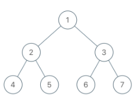

Given the root of binary tree, each node in the tree has a distinct value.

After deleting all nodes with a value in to_delete, we are left with a forest (a disjoint union of trees).

Return the roots of the trees in the remaining forest. You may return the result in any order.

**Example 1**:



**Input**: root = [1,2,3,4,5,6,7], to_delete = [3,5]

**Output**: [[1,2,null,4],[6],[7]]

```js
const delNodes = (root, to_delete) => {
  const remaining = [];
  // set of unique values for constant access
  const toDelete = new Set(to_delete);
  // bottom up works better since we are removing
  const bottomUp = (node, deleteVals, output) => {
    if (node === null) return node;

    node.left = bottomUp(node.left, deleteVals, output);
    node.right = bottomUp(node.right, deleteVals, output);

    if (deleteVals.has(node.val)) {
      if (node.left) output.push(node.left);
      if (node.right) output.push(node.right);
      return null;
    }

    return node;
  };
  // check the root val
  if (!toDelete.has(root.val)) remaining.push(root);
  bottomUp(root, toDelete, remaining);

  return remaining;
};
```
