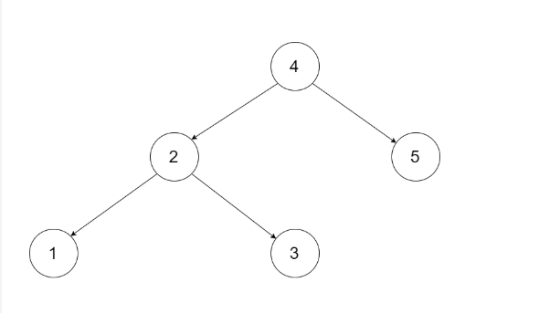
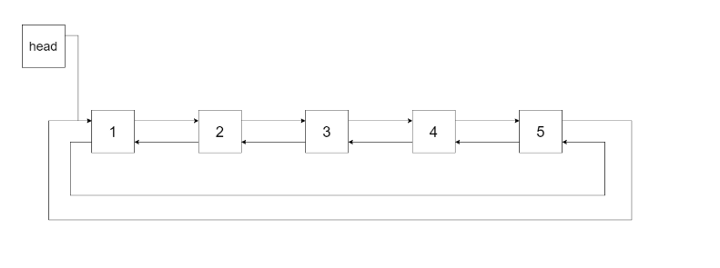
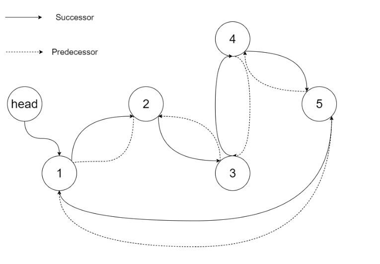

Convert a BST to a sorted circular doubly-linked list in-place. Think of the left and right pointers as synonymous to the previous and next pointers in a doubly-linked list.

Let's take the following BST as an example, it may help you understand the problem better:



We want to transform this BST into a circular doubly linked list. Each node in a doubly linked list has a predecessor and successor. For a circular doubly linked list, the predecessor of the first element is the last element, and the successor of the last element is the first element.

The figure below shows the circular doubly linked list for the BST above. The "head" symbol means the node it points to is the smallest element of the linked list.



Specifically, we want to do the transformation in place. After the transformation, the left pointer of the tree node should point to its predecessor, and the right pointer should point to its successor. We should return the pointer to the first element of the linked list.

The figure below shows the transformed BST. The solid line indicates the successor relationship, while the dashed line means the predecessor relationship.



Credits to: [leetcode.com](https://leetcode.com/problems/convert-binary-search-tree-to-sorted-doubly-linked-list/description/)

Time Complexity: O(n)
Space Complexity: O(depth of tree)

Solution:

```js
function treeToDoublyList(root) {
  // set head and previous variables
  let head = null;
  let prev;
  // edge case if we have no root just return the root
  if (root === null) return root;

  // recursive depth first search in order
  function dfsInOrder(node) {
    // base case - if we hit a leaf just return
    if (node === null) return;
    // call on left to get the smallest number
    dfsInOrder(node.left);
    // this case allows us to grab the smallest node as the head and set prev
    if (head === null) {
      head = node;
      prev = node;
      // this is what reassigns the tree to a doubly ll, reassign previous to keep traversal
    } else {
      node.left = prev;
      prev.right = node;
      prev = node;
    }
    // depth first search on right side
    dfsInOrder(node.right);
  }
  // call depth first search on our root
  dfsInOrder(root);
  // this assigns the last case where we need tail's right to point to head and head's left to point to tail
  prev.right = head;
  head.left = prev;
  // return the tree
  return head;
}
```
